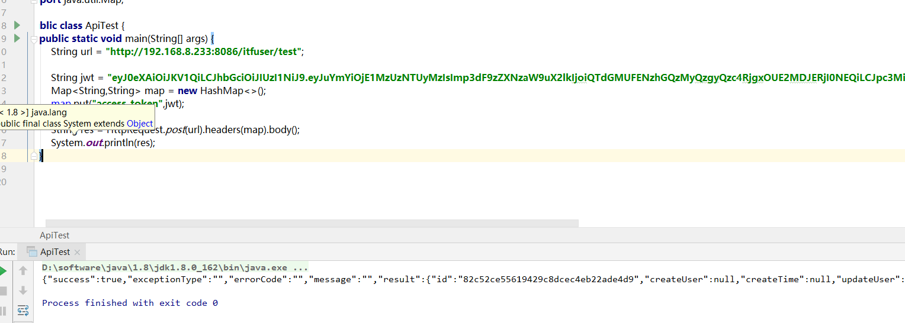

#### 测试登录后的接口

1. url
```
post :  /itfuser/test
```

2. 入参
```
放在请求头
access_token : jwt 字段的值
```

3. 出参
```
-- 成功
{
  success: true,
  exceptionType: "",
  errorCode: "",
  message: "",
  result: {
    id: "82c52ce55619429c8dcec4eb22ade4d9",
    account: "654499437@qq.com",
    name: "johnny",
    pwd: null,
    deptCode: null,
    sex: "1",
    phone: null,
    email: "654499437@qq.com"
  }
}

-- 失败样例
{
  exceptionType: "NOT_LOGIN",
  success: false,
  errorCode: "1001",
  message: "用户未登录,不能访问!"
}
```
#### java代码测试结果

